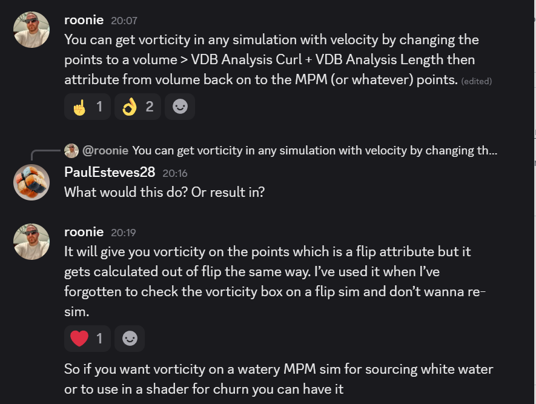

SORT POINTS BY W, group range minimum separate pieces. THis will select the top most point on geo piece.

i@nearPt = nearpoint("unwrap:uv opinput:0",chv("uv_coordinate"));

https://terrytao.wordpress.com/

Blester circuits

min()
repulsion weight
velocity damping
leading edge mask - dilate
extrude volume
delete points - > random
vectors in the viewport

ts proxy trails

Capture cleanup to work with copes.

Velocity stretch to orient particles inside a volume.

Radeon tech rnders - city thigns.

Dashed lines