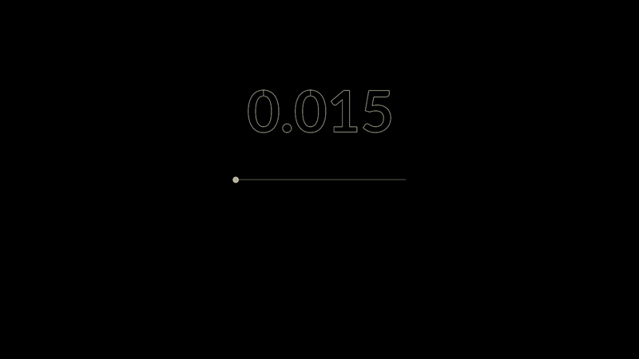

<div class="gallery" data-columns="2">
	
</div>

The starting curve network used in this effect is outlined [here](/notes/tendrils). It gives us a single root point from which the entire network emerges:

<div class="gallery" data-columns="2">
		
		
</div>

In [this example](/notes/traversal-attrib) we sent energy along our curve network using attribs, this time we're going to use POPs.

The crux of the effect is to position a point on a prim with a common VEX function, primuv(). Each prim has an intrinsic set of uvs, 
 only the U component of which is relevant to a polyline. We can use this U value to sample the position (and indeed any attrib) of any point along that prim, moving points along prims by offsetting our sample.



Matt Estela has a longer write up of the extremely useful primuv(), [here](https://tokeru.com/cgwiki/JoyOfVex19.html).

So with this in mind, we can scatter a point onto a prim, record the prim on which that point sits, and then send it along that prim by adjusting a "U" attrib and sampling with ```primuv(0, "P", i@sourceprim, v@sourceuv)```. It's not unlike what a combo of the ScatterSOP (with @sourceprim and @sourceprimuv attribs ticked) followed by an AttributeInterpolateSOP might do, but what happens when we get to the end of the prim in a network? We need to pick a new one. So...

This is the POPs network. We have a POPLocation, a clump of nodes that handle the traversal logic, and a couple of nodes for point replication (more on that later).


So we spawn our points, and let the just born particles (defined with a group in the POPLocation) decide at random which of the prims connected to our starting point that they travel along. This does that:


It's worth noting that I've taken advantage of the fact the POPLocation defaults to spawn particles at the world origin, which happens to co-incide with single our root point. Good for now, but something that coul dbe made more robust given different requirements.

We can retrieve an array of prims connected to any point with the function primpoints(). From this array we pick a random prim, and then we primuv() our way along it.

So yes, we increment the U value that we're using to sample the position on a prim, with a bit of per-particle speed randomization and adjusting for prim length as we go. Looking at this now we could probably optimize away a few of the less prone to changing values, but none the less:


We now have all the information we need to sample the position, so let's do that. The position, and a normal to orient the particle in the direction of the curve (created with an OrientAlongCurveSOP on the sampled curve network):


But what about when we approach a junction? We need to pick a new prim. Here's how.

Any point with a U value greater than one has effectively moved beyond the end of the prim that it's been travelling along, so we can use this to find all the particles that need to choose their next prim. Now, in a similiar way as when picking our initial prim, we can now look up the prims connected to thisthe final point of our *current* prim, and start the process again. We pick a new prim, we reset the uv, we continue onward.

The only additional consideration is what to do if the point is a terminal, if it has no connecting prims. Well... In which case there's nowhere to go and the point must be killed off. Here I've used an incoming *terminalprims* group to check, a group created by a point at the end of a prim having either one neighbouring connection (```neighbourcount(0, last_point == 1)```), or only one connecting prim (```len(pointprims(1, last_point)) == 1```).

BUT. One more thing? As mentioned earlier, a common problem with branching structures is preserving particle density. As particles radiate outwards along generations of branches they will thin out, each descision to go one way will leave an empty branch in all other directions.

So in this instance, rather than having a particle decide which branch to travel down, we can spawn sufficient particles in order to simaultaniously send something along each downstream prim. Why not.

<div class="gallery" data-columns="2">
	
		
</div>

We use a *branch_emission* attrib that dictates how many replicants will be spawned, and then we cycle though our array of connected prims to send the new particles on their way.